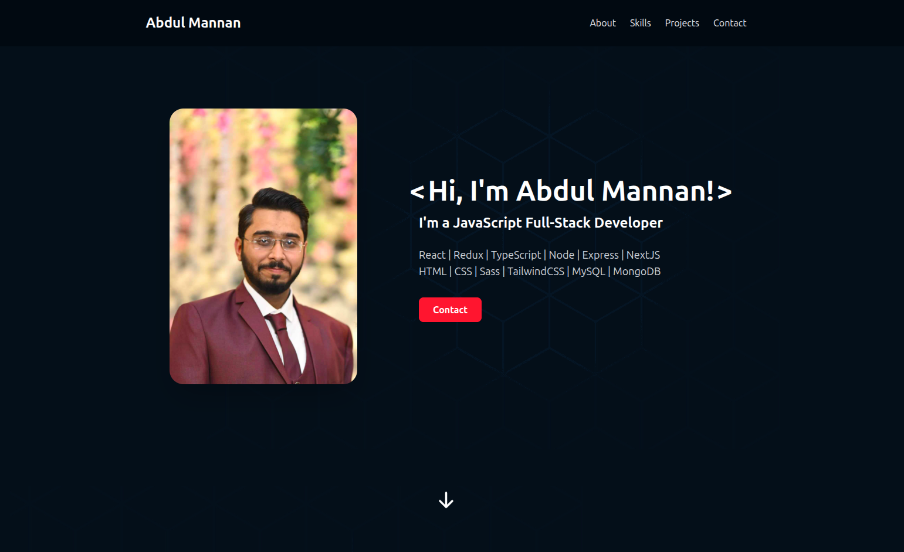

# Abdul Mannan's Portfolio Webpage

## 🌐 Project

This portfolio webpage is a personal project designed to showcase my work, projects, and professional journey. It's a simple, one-page layout with distinct sections including Hero, About, Skills, Projects, and Contact. The design, first conceptualized in Figma for both mobile and desktop modes, follows a clean and modern aesthetic. Developed using React, TypeScript, and Tailwind CSS, this site embodies a mobile-first approach and integrates Web3Forms for the contact section.

### 🏠 [Demo Link](https://mani444.github.io)



## ✨ Features

- **Responsive Design:** Fully responsive for optimal viewing on both mobile and desktop devices.
- **Sectioned Content:** Includes Hero, About, Skills, Projects, and Contact sections for easy navigation and information access.
- **Tailwind CSS:** Utilizes Tailwind CSS for styling, ensuring a sleek and modern look.
- **Web3Forms Integration:** The contact form is powered by Web3Forms, allowing seamless communication.

## 🚀 Design and Development

- **React and TypeScript:** Built with React and TypeScript, providing a robust and efficient framework for the portfolio.
- **Modern UI:** Clean and professional design with smooth animations and interactive elements.

## 🔧 Installation and Setup

Clone the repository

```
git clone https://github.com/mani444/mani444.github.io.git
```

Navigate to the project directory

```
cd mani444.github.io
```

Install dependencies

```
npm install
```

Start the development server

```
npm run dev
```

## 🧠 Reflection

Creating this portfolio was not just about showcasing my skills and projects; it was also a journey in understanding responsive web design and the nuances of integrating various technologies like React, TypeScript, and Tailwind CSS.

## 🛠️ Technology Stack

- React
- TypeScript
- Node
- TailwindCSS
- Shadcn UI Elements

## ⭐️ Show your support

Give a star if you liked and this project helped you!

## 📝 License

This project is open source and available under the MIT License.
